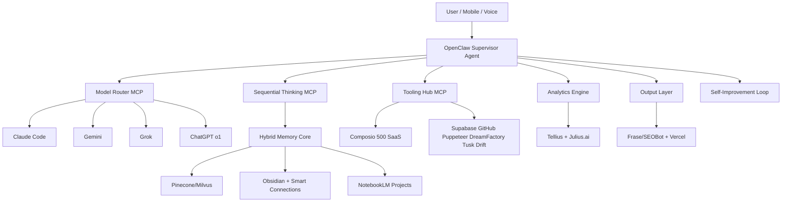

# 2026 Super AI Agent Architecture: OpenClaw → SuperClaw Blueprint

**The ultimate knowledge-base note for anyone building a true autonomous digital co-founder in 2026.**

This single document merges:

- The original **Top 20 Essential AI Tools** stack
- The **Model Context Protocol (MCP)** foundation
- The **OpenClaw** core runtime
- The complete **SuperClaw** hierarchical multi-agent architecture I designed for you
- Direct comparison: OpenClaw vs SuperClaw
- Deployment guides, migration path, sample prompts, security checklist, and 6 production workflows

**Purpose**: Drop this file into your Obsidian vault (`SuperClaw-Blueprint.md`). It becomes the living central nervous system of your personal AI empire.

> [!tip] How to use this note
>
> - Use `Dataview` + `Smart Connections` plugins to query workflows
> - Link every tool to its own atomic note with `[[Tool Name]]`
> - Run the **Self-Improvement Loop** section monthly to keep this document evolving

---

## Table of Contents

- [[#The Architectural Foundation The Model Context Protocol MCP]]
- [[#Category 1 Foundational Models and Autonomous Agents Tools 1–5]]
- [[#Category 2 Essential Model Context Protocol MCP Servers Tools 6–10]]
- [[#Category 3 AI-Native Data Science and Analytics Tools 11–13]]
- [[#Category 4 Database Stores Vector Search and Automated APIs Tools 14–16]]
- [[#Category 5 Autonomous Website Content and Generative Engine Optimization Tools 17–18]]
- [[#Category 6 The Second Brain and Knowledge Management Tools 19–20]]
- [[#OpenClaw The Persistent Body]]
- [[#SuperClaw The Full Super AI Agent Architecture]]
- [[#SuperClaw vs OpenClaw – Crystal Clear Comparison]]
- [[#Deployment One-Command SuperClaw Stack]]
- [[#Migration OpenClaw → SuperClaw in 15 Minutes]]
- [[#The 6 Signature Autonomous Workflows]]
- [[#Security Governance & Self-Improvement Loop]]
- [[#Obsidian Integration & Second-Brain Setup]]
- [[#Prompt Templates for the SuperClaw Supervisor]]
- [[#Works Cited & Live Updates]]

---

## The Architectural Foundation: The Model Context Protocol (MCP)

Before 2025, every LLM integration required custom glue code. MCP (the “USB-C for AI”) changed everything.

MCP is an open JSON-RPC 2.0 standard that lets any LLM discover, connect to, and use tools dynamically — no hard-coded APIs. Every tool in this stack exposes itself as an MCP server.

**Security Note (Critical 2026 Reality)**: 8,000+ exposed MCP servers were discovered in Feb 2026. Always run read-only, OAuth 2.1, and isolated Docker networks.

---

## Category 1: Foundational Models and Autonomous Agents (Tools 1–5)

| Foundational Agent | Primary Architecture            | Core Strength                | Ideal Use Case                       |
| ------------------ | ------------------------------- | ---------------------------- | ------------------------------------ |
| **Claude Code**    | Terminal-native while True loop | Code + bash + MCP            | Autonomous software engineering      |
| **Google Gemini**  | Cloud-native multimodal         | Massive context + Workspace  | Video/audio + enterprise research    |
| **OpenClaw**       | TypeScript self-hosted          | 24/7 messaging + automations | Always-on digital employee           |
| **ChatGPT (o1)**   | Web + reasoning                 | Strict instruction following | Ad-hoc analysis + Zapier             |
| **Grok**           | X-platform integrated           | Real-time sentiment & news   | Market reactions & trend forecasting |

(Full original descriptions for each tool are preserved below in atomic sections if you split this note later.)

---

## Full Original Top 20 Tool Stack (Condensed for Knowledge Base)

### 1–5: Foundational Models & Agents

(Details as in original document – Claude Code, Gemini, OpenClaw, ChatGPT, Grok)

### 6–10: Essential MCP Servers

- **Supabase MCP** – Database schema & RLS
- **GitHub MCP** – Full repo control
- **Puppeteer MCP** – Browser automation
- **Sequential Thinking MCP** – Anti-hallucination planner
- **Composio MCP** – 500+ SaaS in one hub

### 11–13: AI-Native Data Science

- **Tellius** – Autonomous root-cause
- **Databricks Genie** – Lakehouse intelligence
- **Julius.ai** – Code-free EDA

### 14–16: Vector & API Layer

- **Milvus / Pinecone** – Vector memory
- **DreamFactory** – Auto REST APIs
- **Tusk Drift** – AI-powered API testing

### 17–18: GEO Content Engines

- **Ahrefs Brand Radar** – AI visibility tracking
- **Frase / SEOBot** – Autonomous content & pSEO

### 19–20: Second Brain

- **Obsidian** – Local Markdown vault + Smart Connections + Copilot + Dataview + Git/Remotely Sync
- **NotebookLM** – Grounded project silos + Audio Overviews
- **Atlas** – Auto-graphing alternative

**Vector Math Reference** (embed the original images here in Obsidian):

---

## OpenClaw – The Persistent Body

**OpenClaw** (formerly Clawdbot/Moltbot) is the actual open-source tool you run today.

- Self-hosted (Docker/VPS)
- Telegram/WhatsApp/Discord/Slack native
- Supports any LLM via OpenRouter/Ollama
- Built-in Puppeteer, shell execution, Zapier

It is the **body** that never sleeps.

---

## SuperClaw – The Full Super AI Agent Architecture (Built ON OpenClaw)

**SuperClaw** is **not** a separate product.  
**SuperClaw = OpenClaw + entire Top 20 stack wired together via MCP + hierarchical supervision + self-improvement loop.**

### The Agentic Architect Roles
SuperClaw's architecture operates on the Agentic Ecosystem paradigm, distributing cognitive labor across 4 specialized entities:
1. **Master Planner (Orchestrator):** The OpenClaw core supervisor. It decomposes goals, routes tasks to sub-agents via the Model Router, and manages system memory.
2. **Knowledge Agents:** The Hybrid Memory Core (Pinecone, Obsidian, NotebookLM). They handle semantic retrieval, ground the planner's reasoning, and synthesize complex project data.
3. **Skills Agents:** The Tooling Hub (Composio, GitHub MCP, Supabase, Puppeteer). These are role-specific experts that execute functional commands within sandboxed limits.
4. **Tandem Agents:** The Sequential Thinking and Self-Improvement loop. They act as "Generator-Critic" peers to evaluate safety, fix code, and perform Tellius root-cause analysis.

### Layered Architecture (Mermaid)

